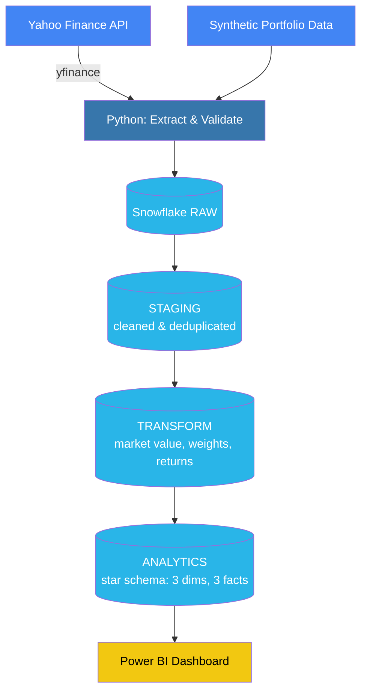

# Investment Portfolio Analytics & Risk Intelligence Pipeline

An end-to-end data engineering and BI project that ingests real market data and synthetic portfolio holdings, transforms it through a layered Snowflake architecture, and delivers portfolio performance, exposure, and risk insights through an interactive Power BI dashboard.

## Business Problem

Portfolio managers need a reliable, automated way to understand portfolio performance, exposure, and risk across multiple funds. This pipeline answers questions like:
- How did each portfolio perform this month?
- Which securities and sectors drive the most risk/return?
- What is our current AUM and position weighting?
- Are there data-quality problems in today's market data?

## Tech Stack

Python (yfinance, pandas) → Snowflake (RAW/STAGING/TRANSFORM/ANALYTICS) → Power BI

## Architecture




## Key Features

- **Real market data**: Live daily OHLCV prices for 15 securities pulled via the `yfinance` API, not fabricated CSVs
- **Layered ETL/ELT architecture**: Data flows through RAW → STAGING → TRANSFORM → ANALYTICS, each layer with a distinct purpose
- **Data quality enforcement**: Validation logic (Python + SQL) catches duplicates, missing values, negative prices, and logical inconsistencies before they reach the analytics layer
- **Real financial calculations**: Market value, position weighting, daily/portfolio returns computed via window functions and weighted aggregation in SQL
- **Dimensional modeling**: Proper star schema (3 dimension tables, 3 fact tables) designed for BI consumption

## Repository Structure
```
investment-portfolio-pipeline/
├── data/            # Source CSVs and extracted data
├── python/          # Extraction, validation, load scripts
├── snowflake/        # SQL DDL for each schema layer
├── powerbi/          # Power BI dashboard file
├── docs/            # Data dictionary and architecture notes
└── screenshots/       # Dashboard screenshots
```

## Data Model

See [docs/data_dictionary.md](docs/data_dictionary.md) for full table/column documentation and business logic definitions.

## Dashboard

*Screenshots coming soon.*

## Author

Urvi — Business Intelligence student, MSU Denver